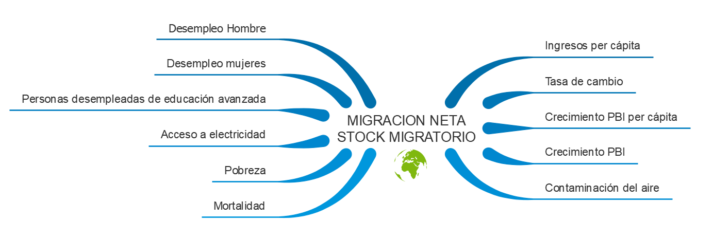
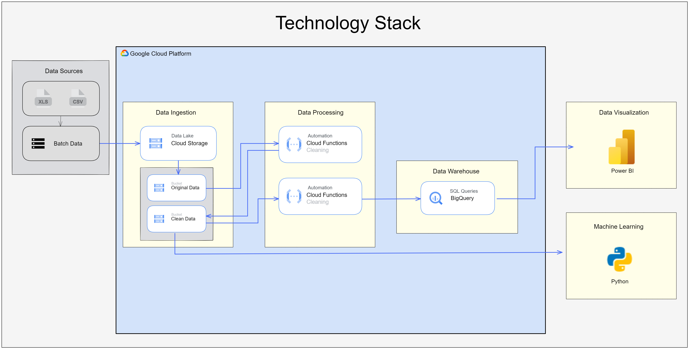
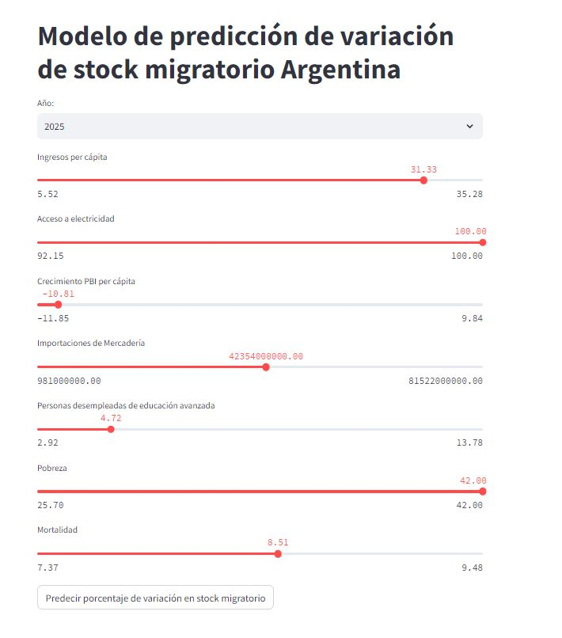

  
    

# 🌎 PF_DataScience_Migraciones 🌍 

Repositorio para Proyecto Final de Data Science en bootcamp Henry, se analizan los datos de migraciones a nivel mudial y nacional. Aplicando un stack tecnológico como Google Cloud Platform, con Machine learning, presentación de KPIs y visualizaciones en PowerBi

## Skillset

- 💻 &nbsp;
  
  
  
- 📚 &nbsp;
  
  
  
  
  
- 🛢 &nbsp;
  
  
- 📊 &nbsp;
  
- ⚙️ &nbsp;
  
  
  
  
  
  

## Enlaces

[Jira](https://jimenafioni.atlassian.net/jira/software/projects/PF/boards/2)  
[Notion](https://www.notion.so/Proyecto-Final-Henry-ee9df2791c4f4a508387789dc02b842e) 
[Drive](https://drive.google.com/drive/folders/1WnKWhaJwMHU0AG0Dm_H0j3qp9_FhGpYF) 
[GoogleCloudStorage](https://console.cloud.google.com/storage/browser?project=pf-data-science&prefix=&forceOnBucketsSortingFiltering=true) 
[Modelo_ML](https://github.com/DATASCIENTISTSHENRY/MODELO-ML) 
[Diccionario_de_datos](https://docs.google.com/spreadsheets/d/1ZPpcAVBxUZQtUsaX5dnRoTXet916yMVO/edit?usp=drive_link&ouid=108785850922164963725&rtpof=true&sd=true) 

## Objetivo y Alcance 📚

El objetivo de este proyecto es obtener un entendimiento del proceso migratorio en Argentina.  
Se analizará la relación entre indicadores económicos, ambientales, sociales y la migración. Se buscará determinar de qué manera se ve afectada la cantidad de migrantes de argentina al modificarse dichos indicadores.
Se realizará una caracterización del proceso migratorio en Argentina, el mismo incluirá el análisis de la cantidad, países de origen y destino de migrantes. Se investigará la distribución geográfica de la población inmigrante en Argentina, analizando las provincias en las cuales se  radican los inmigrantes.
Se determinarán y calcularán indicadores claves de desempeño que tengan como propósito alcanzar una distribución homogénea de inmigrantes en el país. 
El resultado de este análisis se presentará en un dashboard interactivo. También se presentará un modelo de aprendizaje automático que dará como resultado el porcentaje de variación de la cantidad de inmigrantes en Argentina al modificar los indicadores estudiados.
 
## [Fuentes de datos](./FUENTES_DATOS/FuentesdeDatos.md) -- Enlace a la descripción 📚

#### [UNITED NATIONS](https://www.un.org/development/desa/pd/content/international-migrant-stock )

#### [BANCO MUNDIAL](https://datos.bancomundial.org/indicador/SM.POP.NETM)

#### [DATOS DEL GOBIERNO ARGENTINO](https://datos.gob.ar/dataset/interior-ingresos-egresos-personas-al-pais-residencias-otorgadas)

#### [DATOS DEL GOBIERNO ARGENTINO](https://www.argentina.gob.ar/interior/renaper/estadistica-de-poblacion/informes-provinciales)

##	Relación entre migración e indicadores económicos sociales y ambientales. 

  
    

##  Caracterización del proceso migratorio en Argentina
* Principales países de origen y destino de migrantes en Argentina y su evolución en el tiempo.  
* Estructura poblacional de inmigrantes en Argentina  
* Radicación de inmigrantes dentro de Argentina. 

---
## Indicadores de desempeño KPI- Distribución Homogénea en el país (Argentina)

Existe en Argentina una concentración de población tanto nativa como inmigrante en la provincia de Buenos Aires y CABA. A través de los siguientes indicadores claves de desempeño se busca monitorear y definir objetivos para favorecer una mejor dispersión de inmigrantes dentro del territorio Argentino. 
Algunos de los beneficios de tener una distribución más homogénea son: 
•	Fomentar la diversidad cultural y social. Esto puede enriquecer la vida comunitaria y promover la tolerancia y la comprensión entre personas de diferentes orígenes culturales y étnicos.
•	Estimular el crecimiento económico en áreas más pequeñas y menos desarrolladas.
•	Contrarrestar la tendencia de despoblación en áreas rurales o menos desarrolladas

Para establecer los KPI se definen las siguientes zonas:

Zona de alta radicación de inmigrantes: Ciudad Autónoma de Bs As y Provincia de Buenos Aires
Zona de radicación intermedia de inmigrantes: Córdoba, Santa Fe, Mendoza y Neuquén
Zona de baja radicación de inmigrantes: La Pampa, Santa Cruz, La Rioja, Tucumán y Formosa

---
### 🎯 KPI Reducción de residencias otorgadas en zona de alta radicación de inmigrantes. 
***
**Objetivo**  
Disminuir la proporción de inmigrantes que se radican en CIUDAD AUTÓNOMA DE BUENOS AIRES (CABA) y BUENOS AIRES, fomentando la redistribución de residencias hacia otras provincias argentinas.

**Fórmula** 
 KPI1= (Residencias zona de alta radicación/Residencias Totales) trimestre actual − (Residencias zona de alta radicación /Residencias Totales) trimestre anterior

**Justificación**
Este indicador busca medir la variación trimestral en la proporción de residencias otorgadas en CIUDAD AUTÓNOMA DE BUENOS AIRES (CABA) y BUENOS AIRES en relación con el total de residencias otorgadas en el país. Una disminución en este valor indica una tendencia positiva hacia la redistribución de inmigrantes hacia otras provincias argentinas, promoviendo una distribución más equitativa y balanceada de la migración en el país.  

---
### 🎯 KPI Aumento de residencias otorgadas en zona de radicación intermedia de inmigrantes. 
***
**Objetivo**  
Aumentar la proporción de inmigrantes que se radican en la zona de radicación intermedia, incentivando la migración hacia estas regiones y diversificando la distribución de residencias.

**Fórmula** 
KPI2=  (Residencias zona radicación intermedia / Residencias Totales) trimestre actual− (Residencias zona radicación intermedia / Residencias Totales) trimestre anterior.

**Justificación**
Este indicador busca medir la variación trimestral en la proporción de residencias otorgadas en las cinco provincias con mayor cantidad de inmigrantes después de BUENOS AIRES, en relación con el total de residencias entregadas en el país. Un incremento en este valor refleja un aumento en la migración hacia estas provincias, lo cual implica una diversificación y desconcentración de la inmigración hacia regiones más allá de las principales urbes, promoviendo un desarrollo más equilibrado en el interior del país. 

---
### 🎯 KPI Aumento de residencias otorgadas en zona de baja radicación de inmigrantes. 
***
**Objetivo**  
Aumentar la proporción de inmigrantes que se radican en las zonas de baja radicación, fomentando la migración hacia estas regiones y contribuyendo a un mayor equilibrio en la distribución demográfica.

**Fórmula** 
KPI3=(Residencias en zona de radicación baja / Residencias Totales) trimestre actual − (Residencias en zona de radicación baja/ Residencias Totales) trimestre anterior.

**Justificación**
Este indicador mide la variación trimestral en la proporción de residencias otorgadas en las cinco provincias con menos radicaciones en relación con el total de residencias entregadas en el país. Un incremento en este valor refleja un aumento en la migración hacia estas provincias menos pobladas, lo que contribuye a descentralizar la concentración demográfica, estimular el desarrollo en áreas menos densamente pobladas y promover un equilibrio territorial más sostenible en Argentina.

---
## Stack Tecnológico

Para este proyecto es importante contar con una infraestructura sólida, escalable y segura. Es por eso que hemos elegido como stack tecnológico `Google Cloud Platform (GCP)`.

GCP nos ofrece una integración perfecta entre sus servicios, lo que permite un flujo de datos desde el almacenamiento hasta el análisis y la visualización. Esto es esencial para mantener la consistencia y precisión de los datos en todas las etapas del proyecto.
La escalabilidad de los servicios de GCP asegura que el proyecto pueda manejar grandes volúmenes de datos a medida que crece sin perder rendimiento. Esto es un punto muy fuerte ya que es común que en los proyectos relacionados con los datos, este aspecto se pase por alto.
También, ofrece una estructura de precios flexible que se adapta a las necesidades del proyecto. Esto significa que, al utilizar servicios específicos, se puede optimizar el costo, asegurando que el proyecto sea rentable sin sacrificar la calidad del análisis, ya que solo se paga por los recursos que se consumen y utilizan.

Video explicativo de la automatización [Enlace](https://drive.google.com/file/d/19sRh8OGCS8TRUH1Kb6oef4B0fGLy8gEs/view?usp=drive_link)

Para este proyecto vamos a utilizar 3 servicios de GCP. 
El primer servicio es `Cloud Storage`, que lo utilizaremos como Data Lake, el cual van a estar los datasets que obtengamos de las investigaciones. Cloud Storage permite almacenar grandes volúmenes de datos de manera segura y proporciona acceso rápido para análisis posteriores.
El segundo servicio es `Cloud Functions`, que lo utilizaremos para los pipelines de automatización. Acá vamos a crear 2 Pipelines. Uno para la Limpieza de los datasets que ingresan al Cloud Storage, y el otro para la transformación de esos datos y poder insertarlos en nuestro Data Warehouse.
Y el tercer servicio, utilizaremos `BigQuery` como Data Warehouse. En Bigquery podemos manejar un gran volumen de datos y poder realizar consultas de manera eficiente.

La automatización de tareas se ha logrado mediante el uso de Cloud Functions. Se han desarrollado dos funciones programadas en Python:

***Function 01 - ETL***: Esta función se encarga de ejecutar el proceso de Extracción,
Transformación y Carga (ETL) de los dataset que se guarden o actualicen en el primer bucket del `Cloud Storage`. Además, valida la estructura de los datos para que no haya errores al cargar los datasets equivocados, asegurando su adecuada preparación para su posterior análisis.

***Function 02 - Upload to BigQuery***: Esta función se ocupa de importar los datos procesados desde el bucket
que alberga los datasets limpios hacia el Datawarehouse. Pero antes realiza la validacion de los registros de la tabla en la cual se cargan los datasets, para que no hayan filas duplicadas, una vez validados, carga solo los nuevos registros de manera correta.

Es importante destacar que estas funciones realizan todo el trabajo de manera automatizada, dando eficiencia a la carga incremental en el DataWarehouse. Una vez realizado esto, se podra realizar querys en SQL para poder realizar analisis de los datos y poder visualizarlos posteriormente.

Finalmente, se utiliza `Power Bi` para la creación y diseño del dashboard y paneles
de control que permitirán una visualización efectiva de los datos. Además, se
implementan procesos de Machine Learning para la creación de un sistema de
recomendación basado en técnicas de aprendizaje automático

---
## Modelo de Machine Learning 
[Enlace](https://github.com/DATASCIENTISTSHENRY/MODELO-ML)

El propósito principal del modelo consiste en estimar el impacto de las variaciones en diversos indicadores, tales como Ingresos per cápita, Acceso a electricidad, Crecimiento PBI per cápita, Importaciones de Mercadería, Personas desempleadas de educación avanzada, Pobreza y Mortalidad, en la cantidad de inmigrantes que recibe argentina. Se puede ingresar a probar el modelo en el siguiente [link](https://migracion.streamlit.app/)

 

